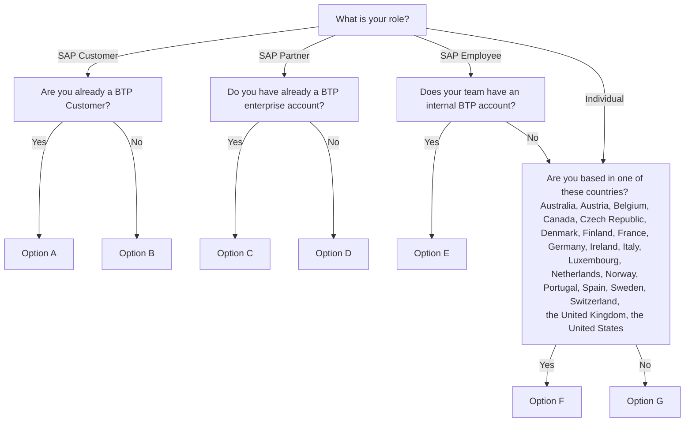

# How to set up a BTP account to try hands-on exercises for free

* **Option A -** You can set up your AI Core Free Tier instance following this [tutorial](https://developers.sap.com/tutorials/ai-core-launchpad-provisioning.html). If you miss SAP AI Core and SAP AI Launchpad entitlements in your account, please contact your account executive.
* **Option B -** Subscribe for a BTP enterprise account through your Company/Organization in [SAP Store](https://store.sap.com/dcp/en/product/display-9999951781_live_v1/SAP%20Business%20Technology%20Platform#pricing). Then set up your AI Core Free Tier instance following this [tutorial](https://developers.sap.com/tutorials/ai-core-launchpad-provisioning.html).
* **Option C -** You can set up your AI Core Free Tier instance following this [tutorial](https://developers.sap.com/tutorials/ai-core-launchpad-provisioning.html). If you miss SAP AI Core and SAP AI Launchpad entitlements in your account, please contact Partner Licensing Service.
* **Option D -** You can sign up for BTP with Pay-As-You-Go commercial model with Free Tier on [PartnerEdge](https://partneredge.sap.com/en/partnership/licenses/tdd/wp_payg_btp.htmlthrough). Then set up your AI Core Free Tier instance following this [tutorial](https://developers.sap.com/tutorials/ai-core-launchpad-provisioning.html).
* **Option E -** You can set up your AI Core Free Tier instance following this [tutorial](https://developers.sap.com/tutorials/ai-core-launchpad-provisioning.html). If you miss SAP AI Core and SAP AI Launchpad entitlements in your account, you can add them through [the internal BTP Control Center](https://controlcenter.ondemand.com/index.html).
* **Option F -** Apply for an individual account following [this tutorial](https://developers.sap.com/tutorials/btp-free-tier-account.html). You will be asked to provide a credit card during subscription, but you will not be charged if you activate free service plans only. Set up your AI Core Free Tier instance following this [tutorial](https://developers.sap.com/tutorials/ai-core-launchpad-provisioning.html).
* **Option G -** Unfortunately BTP enterprise accounts for individuals are not available in your region. You can sign up for a [BTP Trial account](https://www.sap.com/registration/trial.908cb719-0e03-421c-a091-daca045f0acc.html), where you can do exercises for [Week 4 and Week 5](../README.md). However, Week 2 and Week 3 exercises cannot be done in BTP Trial, since AI Core and AI Launchpad are not available there.
