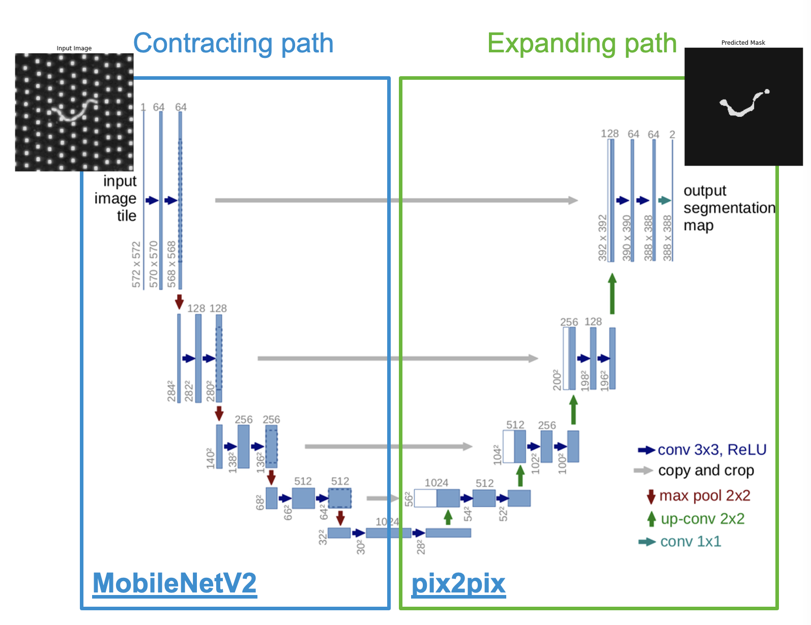
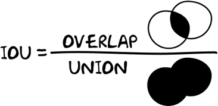
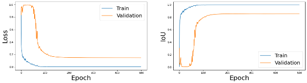
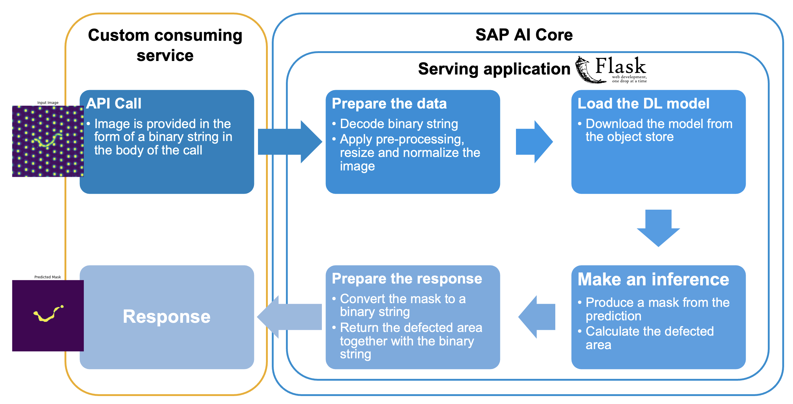
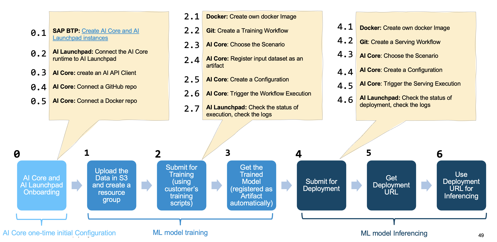

# Building a deep learning model on product images for Automatic Defeat Detection with SAP AI Core
<!--- Register repository https://api.reuse.software/register, then add REUSE badge:

-->

## **Business challenge: image based defect detection**
With the increasing demand, the Light Guide Plates (LGP) production lines must improve quality and speed.
The distribution of the LGP points is uneven and the size, shape, and brightness of the same kind of defects can also differ one from another: the traditional computer vision methods give poor result.

### **Solution**
Deep learning techniques have found wide application in product surface defect detection and are suitable for the detection of complex defects of the LGP.

A DL possible technique to be used is "image semantic segmentation": it is a common technique in digital image processing and analysis: it consists of partitioning an image into multiple parts or regions, often based on the characteristics of the pixels in the image. Semantic segmentation lets you associate every pixel of an image with a class label and this is possible thanks to the use of convolutional neural networks (CNNs).

### **Sustainability benefits**

* Part of the defective products can be still be sold as 2nd quality items reducing waste.
* Reduced price of end product.
* Traditional defect detection is detrimental for workers’ health: with an automated process with DL it is possible to achieve a safer work place.
 

## The Deep Learning model: a modified U-Net

### U-Net architecture

U-Net is a convolutional neural network that originally was presented for biomedical image segmentation at the Computer Science Department of the University of Freiburg. It is based on fully convolutional neural networks and has a modified and extended architecture to work with fewer training images and yield more precise segmentation.

The primary concept is to use a contracting network followed by an expanding network, with upsampling operators in the expansive network replacing pooling operations. These layers increase the resolution of the output. Besides, an expansive convolutional network can learn to assemble a precise output based on encoded information.

The network consists of a contracting path and an expansive path, which gives it the u-shaped architecture. The contracting path is a typical convolutional network that consists of repeated convolutions, each followed by a rectified linear unit (ReLU) and a max-pooling operation. During the contraction, the spatial information is reduced while feature information is increased. The expansive pathway combines the features and spatial information through a sequence of up-convolutions and concatenations with high-resolution features from the contracting path.

### Our modified U-Net architecture

Usually the training of a complex Domain Adversarial Neural Networks (DANN) is a time consuming and expensive process. You need large dataset of images and a long trial and error process to succeed. Many frameworks (keras, tensorflow, pytorch) offer pre-built or pre-trained networks that can be used as a starting point. For these reasons in our scenario we have decided to use a MobileNetV2 as encoder, in-order to learn robust features and reduce the number of trainable parameters and to free the parameters in some of its layers.
MobileNetV2 network was trained on more than a million images from the ImageNet database. Therefore the network has learned rich feature representations for a wide range of images.
The upsample block is instead taken from the implementation in the pix2pix example available in the TensorFlow Examples repo.

### Metrics and loss function

The Intersection-Over-Union (IoU) is one of the most commonly used metrics in semantic segmentation. 
This metric ranges from 0-1 with 0 signifying no overlap and 1 signifying perfectly overlapping segmentation.

* Overlap = number of pixel belonging to the defect class shared among prediction and ground truth

* Union = sum of the number of pixel belonging to the defect class in the prediction and ground truth - overlap

We have defined a specific and more suitable loss function for our use case in order to evaluate how well our algorithm models the dataset: 1 - IoU.

## Description

In this folder you can find everything used to develop the solution to the business challenge of LGP automated defect detection with Deep Learning techniques in SAP AI Core and SAP AI Launchpad. Please, find below the list and description of each folder and their content:

- **code**
 	* **train_seg** 
  		* It contains the python code to build the semantic segmentation model, to preprocess the data and to train the model itself on SAP AI Core.
  		* It contains also the requirements.txt and the Docker file to dockerize the train.py python code.
 	* **infer_seg**
  		* It contains the code for the serving web application that will be deployed in SAP AI Core to serve the inference requests to the semantic segmentation model.
  		* It comntains also the requirements.txt and the Docker file to dockerize the infer.py python code.
- **data**
	* It contains the LGP image datasets and the relative ground truth divided per category: defected (labeled as NG) and normal LGP devices (labeled as OK).
	* This is basically the dataset that is already uploaded in the AWS S3 bucket at the path: 
	&nbsp;&nbsp;&nbsp;&nbsp;&nbsp;&nbsp;aws s3 ls s3://ai-sustainability-dataset/image/data/
- **exercises**
	* **files**
		* This folder contains the credential files to be filled in order to go through exercise 1.
		* This folder contains also the training and serving template files to be customized in order to go through exercise 1.
 	* **defect-detection-part1.ipynb**
 		* This is the Jupyter notebook with the AI Core one-time configurations that a participant is required to go through during exercise 1.
 		* It contains detailed instructions for all the steps.
 	* **defect-detection-part2.ipynb**
 		* This is the Jupyter notebook to follow in order to execute the training of the semantic segmentation model and retrieve the metrics in SAP AI Core.
 		* It contains detailed instructions for all the steps.
- **notebooks (ONLY for reference, not needed for exercise 1)**
	* **defect_detection_development_segmentation.ipynb**
		* This is the Jupyter notebook where all the development steps are tested: loading the data, preprocess the data, prepare the datasets for training, validation and test, build and initialize the model, test the model).
	* **defect_detection_aicore_notebook_one_time_config.ipynb**
		* This is the Jupyter notebook to execute all the one-time configurations in SAP AI Core.
	* **defect_detection_aicore_notebook_train_infer.ipynb**
		* This is the Jupyter notebook to execute the training of the semantic segmentation model and retrieve the metrics in SAP AI Core.
		* This is also the Jupyter notebook to execute the deployment of the semantic segmentation model in SAP AI Core and that shows how to use the exposed URL to make an inference.
	* NB: These notebookes are intended to be used locally.
- **workflows (ONLY for reference, not needed for exercise 1)**
	* **training_workflow_seg.yaml**
		* It's the template that specifies the training parameters and the training workflows in terms of Docker containers.
		* This file has to be loaded in the GitHub repository that will be connected to SAP AI Core.
	* **serving_workflow_seg.yaml**
		* It's the template that specifies all the parameters needed to deploy and serve the web application.
		* This file has to be loaded in the GitHub repository that will be connected to SAP AI Core.

## **Training python code**

train.py is a Python class which implements all the required steps developed and tested in the Jupyter development notebook. This piece of code can be run in SAP AI Core and is expected to include the following methods:

- **read_dataset:** to load the images and apply some pre-processing;
- **split_dataset:** to split the dataset among train, validation and test samples;
- **build_model:** to build the chosen mode;
- **init_model:** to initialize and compile the model:
- **train_model:** to configure the training and execute it;
- **save_model:** to save the model;
- **get_model:** to load the model;
- **model_metrics:** to define and register the chosen metrics.

## **Serving python code**

## **SAP AI Core end-to-end workflow**

## Requirements
* [Prerequisites for Linux/MacOS](../../../prerequisites/prerequisites.md)  
* [Prerequisites for Windows](../../../prerequisites/prerequisites_win.md)  
* [Requirements](../../../prerequisites/requirements.txt)

## Download and Installation

## Known Issues

## How to obtain support
[Create an issue](https://github.com/SAP-samples/<repository-name>/issues) in this repository if you find a bug or have questions about the content.
 
For additional support, [ask a question in SAP Community](https://answers.sap.com/questions/ask.html).

## Contributing
If you wish to contribute code, offer fixes or improvements, please send a pull request. Due to legal reasons, contributors will be asked to accept a DCO when they create the first pull request to this project. This happens in an automated fashion during the submission process. SAP uses [the standard DCO text of the Linux Foundation](https://developercertificate.org/).

## License
Copyright (c) 2022 SAP SE or an SAP affiliate company. All rights reserved. This project is licensed under the Apache Software License, version 2.0 except as noted otherwise in the [LICENSE](LICENSES/Apache-2.0.txt) file.
